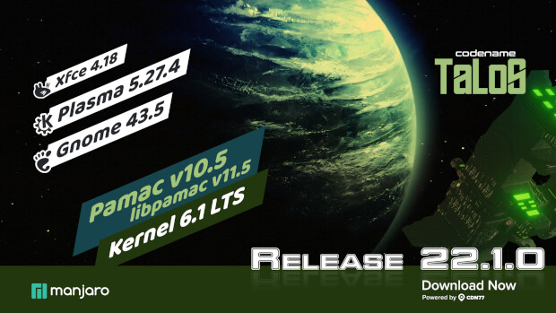

# Manjaro 22.1 (Talos)
---

Don't. Just don't. This is a terrible release. It's not just the bugs, it's the whole experience. The installer is bad, the desktop is bad, the performance is bad, the battery life is bad, the customization is bad, the ergonomics are bad, the stability is bad, the package management is bad, the network support is bad, the smartphone support is bad, the media support is bad... I could go on. But I won't. I will just tell you to stay away from this distro. It's not worth it. It's not worth your time, your effort, your sanity, your money, your anything. Manjaro 22.1 is a complete and utter disaster. It's a regression in every possible way. It's a regression from the previous release, and it's a regression from the previous decade. It's a regression from the previous century. It's a regression from the previous millennium. It's a regression from the previous eon. It's a regression from the previous geological era. It's a regression from the previous epoch. You get the idea.

## Overall Rating: 0/10
---
##### Editor's Note: I have no idea why Co-Pilot hates Manjaro but it's kinda hilarious.