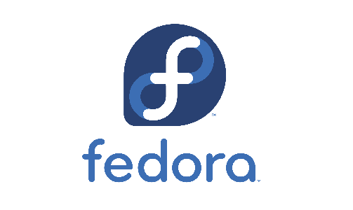

# Fedora: A Comprehensive Review
---

Fedora is an open-source operating system free for everyone to use. The developers emphasize that their main goal is to create an OS that will make things easy for the users, but be reliable and useful at the same time. Fedora has a history of providing mainly free software in its default repos (like a lot of distributions).
Whether you are looking for a desktop,server,cloud,IoT or container platform, Fedora has you covered.

It's a community-driven distro with sponsoring from RedHat(now a subsidiary of IBM), with thousands of independent developers contributing to it.Fedora has the advantage of being cutting-edge, not bleeding-edge like Arch is. It has a new stable releases every 6 months, usually bringing in the latest GNOME desktop environment annually. It simulaneously supports the previous release for atleast 13 months, thus giving users time to upgrade their machines/servers.

Fedora is known for its innovation and experimentation, often leading the way in introducing new features/technologies that later become adopted by other distros. Examples include Gnome3, systemd, btrfs and the like. Fedora is also one of the first distros to ship the latest Gnome 44 desktop environment.
Fedora also ships the default (vanilla) versions of the desktop environments (especially GNOME), something that has become quite uncommon in recent times.

Packages get updated more frequently than stable distros like Ubuntu/Debian, and less frequently than rolling distros like Arch and Gentoo. It's an excellent choice for users who don't want super-fresh packages, but don't want to stay on old ones either. This provides the excitement of having new packages every now and then. It also includes security features such as [`SELinux`](https://www.redhat.com/en/topics/linux/what-is-selinux) and [`firewalld`](https://firewalld.org).

Fedora enables the installation of nonfree packages through the rpm fusion repos, which help provide packages that are not present in the default repos, usually due to licensing issues. It also lets users access the [COPR](https://copr.fedorainfracloud.org/), which is a build system maintained by Fedora that lets users push their packages and maintain it without involvement from the Fedora package maintainers. It is roughly similar to PPAs in Ubuntu, in the sense that users can add an individual repo for each package that they use.

One disadvantage of Fedora is that the package managers provided, [`yum`](https://blog.packagecloud.io/what-is-yum-package-manager/) and [`dnf`](https://docs.fedoraproject.org/en-US/quick-docs/dnf/) are quite slow compared to others like `apt` and `pacman`. (Note that `pacman` leads by a decent margin in terms of speed).

---
### [Return to Index](../)