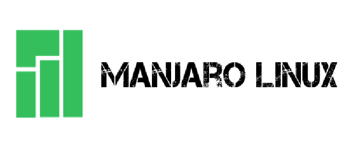

# Manjaro: A Comprehensive Review
---

As someone who has used Manjaro as my primary development OS, It is quite stable, customizable and easy to use. Manjaro is a rolling-release Linux distribution that aims to make Arch Linux more user-friendly. It follows a rolling-release model, meaning that current users do not need to reinstall unless their current installation is broken.

## User Interface

Manjaro's default interface is the Xfce desktop environment. I found the interface to be clean, simple, and easy to navigate. The menu is organized and intuitive, and the system settings are easy to access. One of the standout features of Manjaro is its theming, which is modern and visually appealing.

## Community 
Manjaro has a vibrant and active community, which is one of its biggest strengths. The Manjaro forums are an excellent resource for troubleshooting, and the community is friendly and helpful. Additionally, Manjaro has an active presence on social media, which makes it easy to stay up-to-date on the latest news and updates. It also includes the `Manjaro Hello` app that gives users quick access to various tasks. These "welcome" apps (an another example being the Arcolinux Welcome App) serve as great resources for beginners. It also includes [kernel management](https://wiki.manjaro.org/index.php/Manjaro_Kernels) and [hardware detection](https://wiki.manjaro.org/index.php/Manjaro_Hardware_Detection) tools, as well as its own pacman-based package manager, [pamac](https://wiki.manjaro.org/index.php/Pamac).

Manjaro has 3 official editions:
- [Gnome](https://manjaro.org/static/img/gnome.webp?auto=compress&cs=tinysrgb&dpr=2&h=750&w=1260):
    
    The GNOME desktop environment itself is highly customizable, and Manjaro GNOME also comes with a few additional customization options. Users can use the GNOME Tweak tool to customize various aspects of their desktop, including the layout, fonts, icons, and more.
    The recommended system requirements for Manjaro GNOME are 1 GB RAM and a 1 GHz processor, which makes it a great choice for users with older computers.I found it to be snappy and responsive, even when running multiple applications at once.
- [KDE](https://manjaro.org/static/img/plasma.webp?auto=compress&cs=tinysrgb&dpr=2&h=750&w=1260):

    Manjaro KDE comes with the latest version of the KDE Plasma desktop environment, which is known for its modern and customizable design. The interface is intuitive, *quite* Windows-like and easy to navigate, and users can customize the look and feel of their desktop using the built-in KDE customization options. Manjaro KDE also comes with a few additional applications, including Krita for digital drawing and Kdenlive for video editing.

    Customization Manjaro KDE provides users with a high degree of customization options. The KDE Plasma desktop environment itself is highly customizable, and Manjaro KDE also comes with a few additional customization options.Recommended system requirements for Manjaro KDE are 2 GB RAM and a 1 GHz processor.

- [XFCE](https://manjaro.org/static/img/xfce.webp?auto=compress&cs=tinysrgb&dpr=2&h=750&w=1260): 

    Manjaro XFCE is the most resource-efficient of the three official editions. XFCE is a light and customizable desktop. It is GTK-based, like GNOME, but includes minimal software out of the box. It is modular and includes apps such as Thunar (file manager) and Catfish (file searcher). XFCE apps are known to not contain too many dependencies[^1], making them [worth installing] even in other DEs and WMs.

In addition to the official editions, Manjaro also has several *community-maintained* editions for Sway, Budgie, i3, Cinnamon and Mate.

Manjaro has teamed up with [Pine64](https://pine64.org), [Tuxedo Computers](https://www.tuxedocomputers.com/), [Slimbook](https://slimbook.es/en) and others to sell computers with ~~Windows~~ Manjaro preinstalled as the OEM OS (But these companies also offer users the option to choose other distros).

The **disadvantages** of Manjaro include:
- Held-back packages:
    Manjaro maintains its own repos which are independent of Arch's repos. Manjaro performs _more_ rigorous package testing than Arch, and hence the packages on Manjaro are usually held back for up to 2 weeks. This can cause **serious** stability issues on rolling releases such as Manjaro itself. Further, packages from the AUR might not work on Manjaro because of dependency and version issues.

- AUR support in Pamac:
    The **A**rch **U**ser **R**epository is a community-maintained set of packages that are designed with Arch and Arch-based distros in mind. It consists of packages, which, for one or more reasons, aren't present in the default Arch repos (some Arch-based distros which contain extra repos *might* have these software). Considering the AUR is not officially supported in Manjaro (as a result of these stability issues) Manjaro has no reason to enable the AUR by default (through `pamac`), but it does. This is a very dangerous thing to do.

#### Non-Manjaro Arch-based distros do not have the above disadvantages.

### NOTE: The below is *my personal opinion*.
Manjaro is ***not*** a distro a new-to-Linux user should be using. Other distros like Arcolinux and Endeavour provide the same benefits that Manjaro once uniquely boasted of (being "Arch with a GUI installer") and hence new-to-Linux users might as well use them.

[^1]: GTK and Qt are 2 toolkits that do not work well with each other. Hence installing Qt apps on GNOME and/or GTK apps on Plasma is not a good idea. The apps generally do not look nice in the counterpart desktop environment, and usually contain a large number of dependencies (GTK dependencies and Qt libraries resp.).

---
### [Return to Index](../)