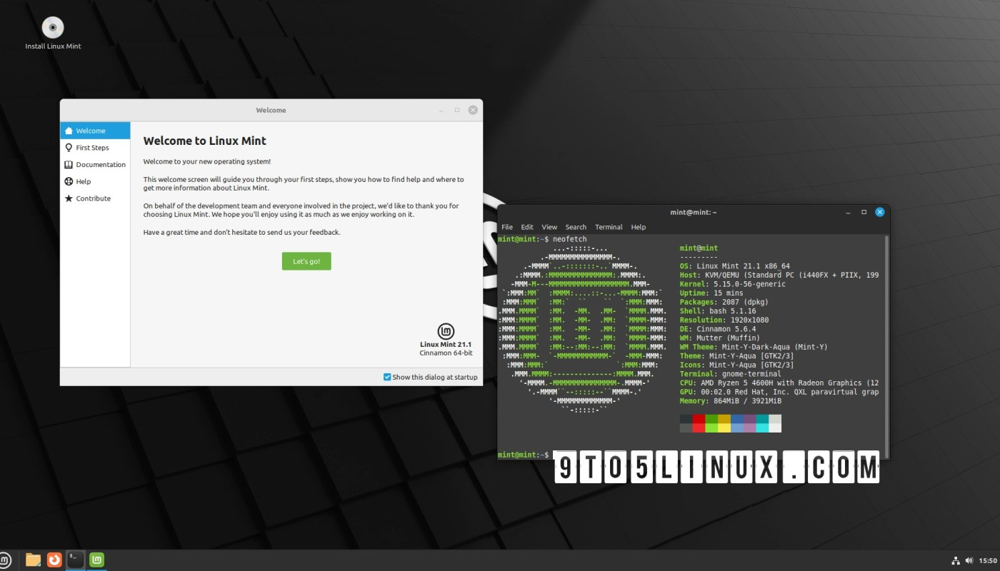
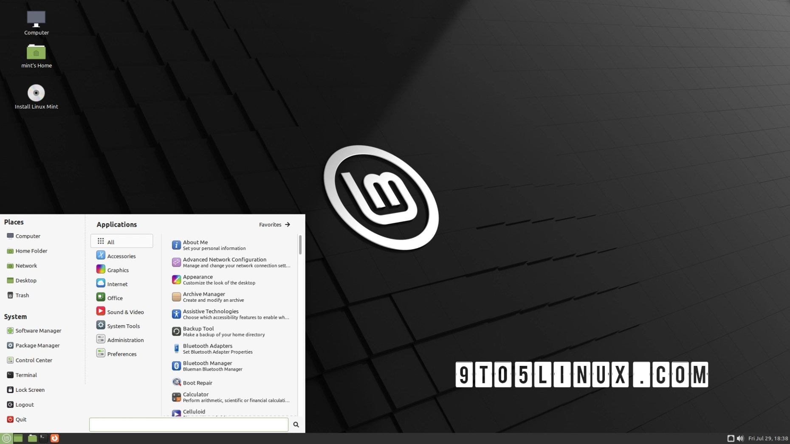
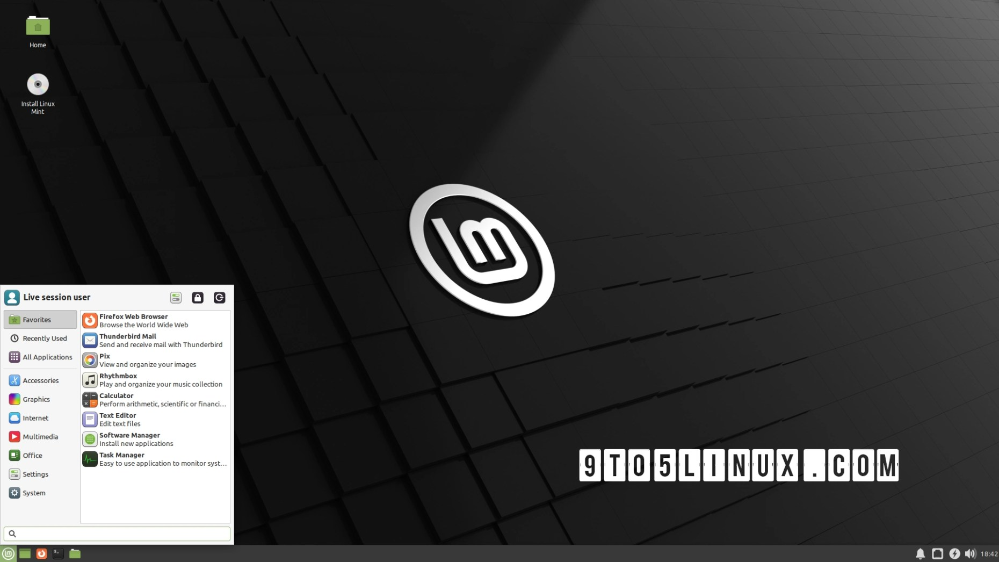

# Linux Mint: A Comprehensive Review
---

Mint is a Linux operating system based on the latest Ubuntu LTS version (22.04 LTS at the time of writing - which makes the current Mint release supported until '25).It is one of the most popular and user-facing distros, and is an excellent choice for beginners who want a hassle-free experience with Linux.

Mint's set of apps, known as the X-Apps, are usually forked from the GNOME apps. Nemo, the Cinnamon file manager, is forked from the Gnome File Manager [Files](https://wiki.gnome.org/Apps/Files) (formerly known as Nautilus). Nemo has features such as bulk renaming and disk space indicators.

Mint consists of:
- A new file manager called Nemo that supports file pinning, bulk renaming, disk space indicators, and more.
- A new update manager that allows you to control when and how updates are installed, and also shows the origin of each package.
- A new system monitor that shows detailed information about your system resources, processes, disks, and network.
- A new web app manager that lets you turn any website into a desktop app for immediate access.
- A new sticky notes app that lets you create notes on your desktop with different colors and fonts.
- A new IPTV app that lets you watch TV channels from around the world2.
- A new Warpinator app that lets you transfer files across the local network without any configuration.

It comes with 3 flavours:
- Cinnamon:

    This is the most popular Cinnamon DE, being developed by the Mint team itself. It is lightweight, fast and stable. The Cinnamon desktop is GTK-based and can be themed. It has support for applets and widgets.Cinnamon is the _flagship_ DE that Mint offers. It strives to offer a balance between simplicity, performance and functionality.

- MATE:

    MATE is a desktop environment that was designed to serve as the continuation of Gnome 2. Several Gnome2 apps have been forked from to create the MATE apps. The MATE edition of Mint is classic and traditional, faster, lighter and more stable than Cinnamon, but development is generally slower and feature releases are fewer.

- XFCE:

    XFCE is a very lightweight desktop environment, designed to run even on low-end computers.Linux Mint Xfce edition is a solid, stable, and user-friendly operating system that can suit the needs of most users who want a lightweight and efficient desktop. It is especially recommended for older or low-powered systems or for users who prefer a simple and efficient desktop.

In conclusion,

Mint is the perfect distro for beginners, but is not preferred by advanced users who prefer to tweak and hack their window managers.

---
### [Return to Index](../)